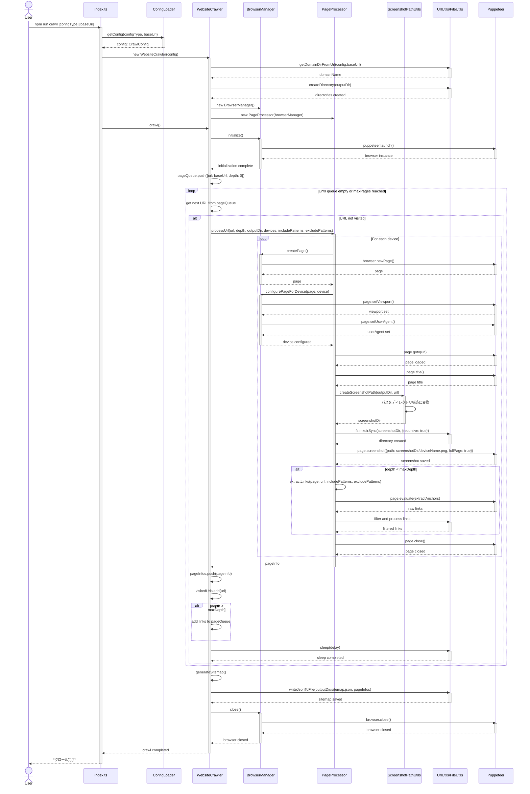
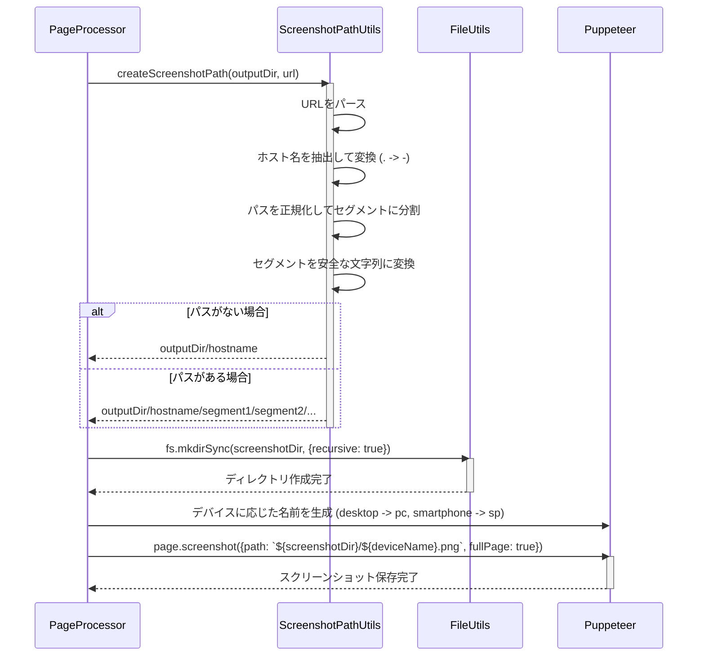
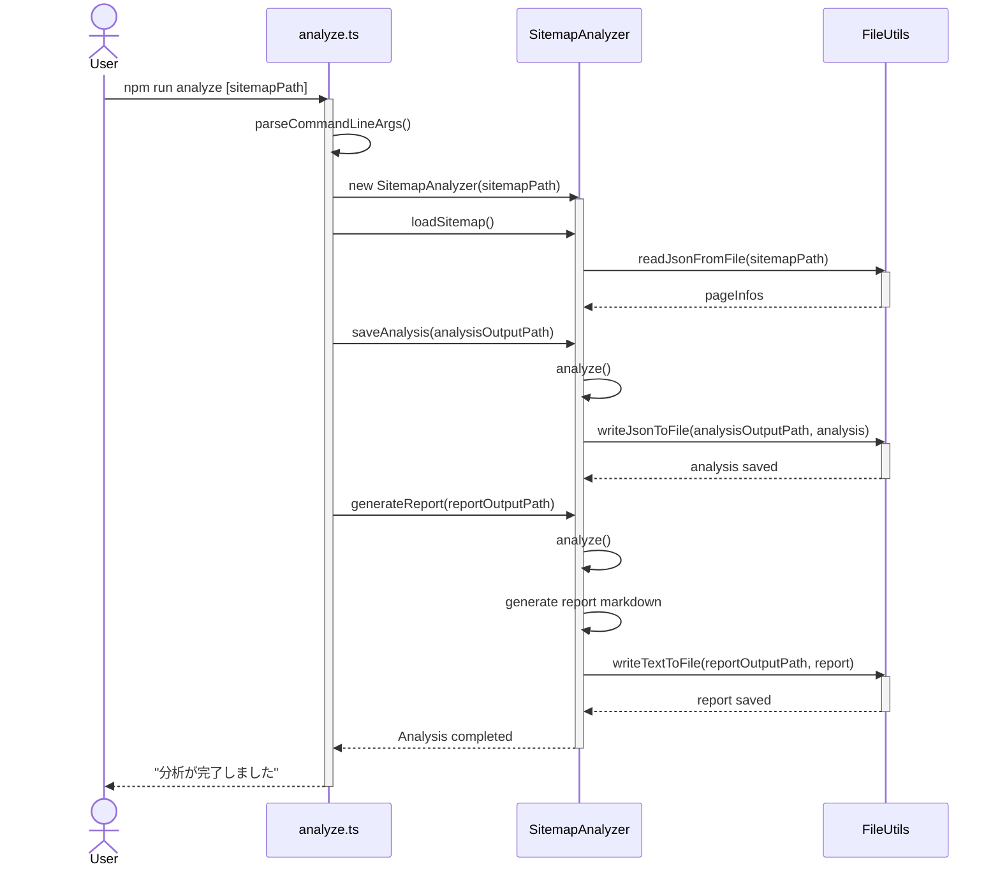

# ウェブサイトスクリーンショット収集システム シーケンス図

## クロールプロセスのシーケンス図



## スクリーンショットパス生成フロー



## 分析プロセスのシーケンス図



## スクリーンショット保存ディレクトリ構造

### 更新後のディレクトリ構造

```
[outputDir]/
├── www-airbnb-jp/
│   ├── pc.png      # トップページのdesktopスクリーンショット
│   ├── sp.png      # トップページのsmartphoneスクリーンショット
│   ├── canmore-canada/
│   │   └── stays/
│   │       └── pet-friendly/
│   │           ├── pc.png  # desktopスクリーンショット
│   │           └── sp.png  # smartphoneスクリーンショット
│   └── benalmadena-spain/
│       └── stays/
│           └── houses/
│               ├── pc.png  # desktopスクリーンショット
│               └── sp.png  # smartphoneスクリーンショット
└── sitemap.json  # クロール結果のサイトマップ
```

## 全体的なワークフローの概要

1. **クロールプロセス**:
   - ユーザーがコマンドを実行
   - 設定を読み込み
   - WebsiteCrawlerがインスタンス化され、クロール開始
   - ブラウザが初期化され、各ページにアクセス
   - 各デバイスごとにURLパスに基づいたディレクトリ構造でスクリーンショットを撮影
   - リンクを抽出し、次のクロール対象をキューに追加
   - すべてのページを処理後、サイトマップJSONを生成
   - ブラウザを閉じて完了

2. **分析プロセス**:
   - ユーザーが分析コマンドを実行
   - サイトマップJSONを読み込み
   - サイト構造を分析
   - 分析結果をJSONとして保存
   - 人間が読みやすいMarkdownレポートを生成
   - 完了を通知
